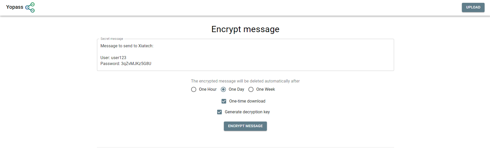

# Sharing Sensitive Information with Xiatech

Welcome from Xiatech, you have been given this guide as someone from Xiatech has requested some potentially private or sensitive information. By following this guide, you will use Xiatechs Onetime-link to share information in an encrypted and secure way.

Please follow the steps below.

-------

## Sharing links

When sharing our links, please be aware that once they are opened by anyone, they will not be retrievable again. The links and the information inside are truly "one time" and if it is accidentally clicked or used, you will have to re encrypt the message. 

## Security

We advise that you send you do not post these links to public forum's or spaces, especially decryption keys, for if someone has access to the decryption key they will be able to unencrypt your message. So please take utmost care that when you share this link/key with a Xiatech employee, it is sent on the most secure channel available.

----
# Instructions

## Encrypting your message

This section covers the first step of encrypting your message and the options that should be selected as default:

- Visit our stopgap page: https://stopgap.xiatechs.co.uk/
  
- Enter the sensitive information you want to encrypt in the top box

- Set the time the encrypted message will be deleted automatically on. For this setting, we suggest 24 hours/One day.

- Ensure one-time download and generate decryption key are both ticked.

Your screen should resemble the below image:

## Sharing your message

This section covers sending of the link/decryption keys:

You will be presented with three copyable items:

- One-click link (we do not recommend you use this)
  
- Short link 

- Decryption key

Please copy the short link and decryption key and send these to the Xiatech employee who requested the sensitive information. Once they use the decryption key to see your message, it will be destroyed immediately, forever!

